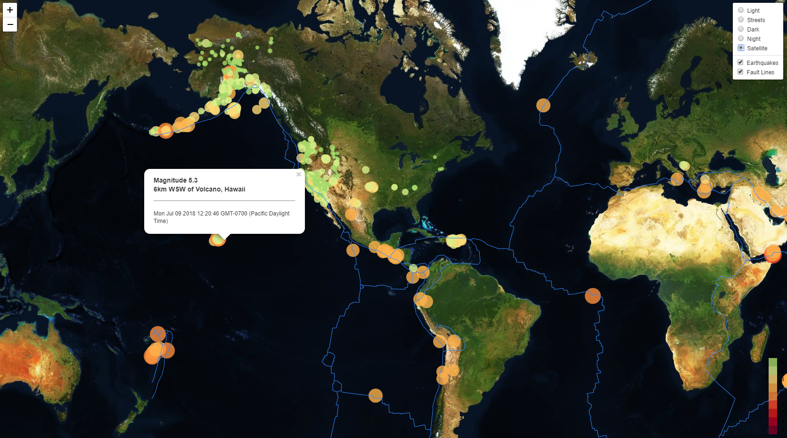

# usgs-quake
Earthquake Datamap: The USGS is responsible for providing scientific data about natural hazards, the health of our ecosystems and environment; and the impacts of climate and land-use change. Their scientists develop new methods and tools to supply timely, relevant, and useful information about the Earth and its processes.

## Webpage:
* https://jayleh.github.io/usgs-quake/

## Technology Stack:
HTML/CSS/Bootstrap 
Javascript 
D3.js 
Leaflet.js

## Data Sources:
* https://earthquake.usgs.gov/earthquakes/feed/v1.0/geojson.php
* https://raw.githubusercontent.com/fraxen/tectonicplates/master/GeoJSON/PB2002_boundaries.json

## License
[MIT](LICENSE) © Justin Le